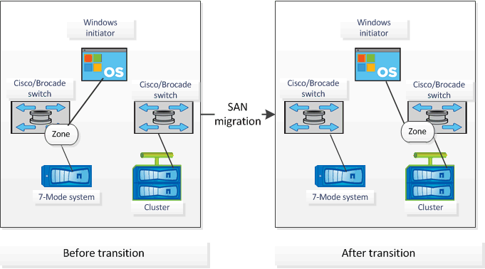

= 支持用于生成 FC 分区计划的配置
:icons: font
:imagesdir: ../media/

[role="lead"]
要生成 FC 分区计划，您必须了解支持的 7- 模式系统，主机， FC 交换机和集群配置。迁移后，应使用该计划为集群配置分区。

根据数据中心的要求， 7- 模式系统（单个控制器或 HA 对），主机和集群可以连接到同一个网络结构或不同网络结构中的交换机。

下图显示了 7- 模式系统，主机和集群连接到同一网络结构中的交换机的配置：

image::../media/fc_zone_config1.gif[下图显示了 7- 模式的配置 系统,hosts,and cluster are connected to the switches in the same fabric]

下图显示了 7- 模式系统和集群连接到不同网络结构中的交换机的配置：

