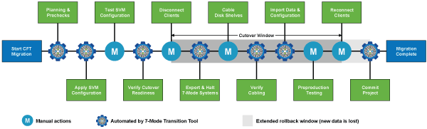

= 无副本过渡的阶段
:allow-uri-read: 
:icons: font
:imagesdir: ../media/

[role="lead"]
使用 7- 模式过渡工具进行无副本过渡包括以下阶段：规划， SVM 配置，导出和暂停，布线，导入， 预生产测试，开始生产和提交。您应了解有效管理过渡的各个阶段。

无副本过渡会造成系统中断。因此，您必须为 7- 模式存储系统上运行的应用程序和工作负载规划停机时间。

在大多数情况下，存储转换时间可以为 3 到 8 小时。转换时间包括工具执行两个自动操作所用的时间，即导出和暂停操作和导入操作，以及用缆线将磁盘架手动连接到新控制器所用的时间。导出和暂停操作以及导入操作一起最多可运行 2 小时。

NOTE: 对于扩展配置，导出和暂停操作以及导入操作可能需要 2 小时以上的时间。7- 模式过渡工具会检测此类情况并提供警告。

为磁盘架布线可能需要 1 小时到 6 小时。本转换时间指南不包括所需的预生产测试时间，并假定过渡无错误，无意外故障，例如磁盘故障。

== 规划项目

您可以计划有关无副本过渡项目的源和目标的以下详细信息：

* 7- 模式 HA 对和 vFiler 单元详细信息
* 目标集群节点以及源控制器到目标的映射 节点
* 7- 模式控制器或 vFiler 单元到 SVM 的映射
* 要过渡的 IP 地址 （新 LIF 或现有 7- 模式 IP 地址） 以及 SVM 上的 IP 空间和广播域
+

NOTE: 7- 模式过渡工具不支持过渡 FC 和 iSCSI LIF 。过渡前，必须在 SVM 上手动配置这些 LIF 。

在此阶段，将运行预检来验证 7- 模式 HA 对是否已准备好迁移到集群模式 Data ONTAP 。7- 模式过渡工具还会验证集群配置是否正确，并支持过渡。

在继续过渡之前，您必须解决所有错误。尽管该工具允许您在不解决警告的情况下继续操作，但最佳做法是在继续过渡之前解决所有警告。您可以多次运行预检，以验证所有错误是否均已解决。

== SVM 配置

规划过渡项目后，您必须执行一些手动任务，例如添加许可证，创建 CIFS 服务器和创建 SAN LIF ，以便为集群和 SVM 做好过渡准备。

然后，您可以使用工具在 SVM 上应用配置。所有 7- 模式控制器或 vFiler 单元级别配置都会过渡到映射的 SVM 。此阶段不会过渡卷和 LUN 配置；它们会在导入阶段过渡。

在此阶段结束时，您应手动验证应用于 SVM 的配置并进行必要的更改。

== 导出存储配置并暂停 7- 模式系统

此阶段将启动无副本过渡的转换窗口。必须手动断开客户端访问。但是，所有 NAS 和 SAN 服务都必须在 7- 模式 HA 对上启动并运行。这是因为， 7- 模式过渡工具要求所有服务都已启动且正在运行，以便从 7- 模式系统收集卷级别配置。

该工具会在导出阶段执行以下操作：

* 收集所有卷和存储配置
* 为每个过渡聚合创建一个 Snapshot 副本
+
如果需要，可以使用此 Snapshot 副本回滚到 7- 模式。

* 在维护模式下启动 7- 模式控制器
* 从连接到 7- 模式的磁盘中删除磁盘所有权 控制器
* 在目标集群节点上禁用磁盘自动分配

== 为 7- 模式磁盘架布线

您必须手动执行此阶段的任务。您必须确保磁盘架 ID 在 7- 模式控制器和目标集群节点之间是唯一的。

NOTE: 如果存在重复的磁盘架 ID ，则必须更改磁盘架 ID 并重新启动磁盘架。

您必须断开所有 7- 模式磁盘架的连接，然后将其热添加到目标集群节点。将磁盘架连接到目标集群节点后，必须重新启动磁盘架。

最佳做法是使用 Config Advisor 手动验证布线。Config Advisor 是一款适用于 NetApp 系统的配置验证和运行状况检查工具。它可以部署在安全站点和非安全站点上，用于数据收集和系统分析。

然后，您可以使用 7- 模式过渡工具验证布线情况以继续过渡。7- 模式过渡工具仅执行 Config Advisor 执行的部分布线检查。

== 导入 7- 模式数据和配置

在此阶段，所有存储对象（聚合，卷和 LUN ）以及相关配置都会过渡。

该工具会在导入阶段执行以下操作：

* 7- 模式磁盘将分配给映射的目标集群节点。
* 所有 7- 模式聚合，卷和 LUN 都会转换为集群模式 Data ONTAP 格式。
* LIF 在管理启动状态下在 SVM 上配置。
* 此时将应用所有卷级别和 LUN 级别配置。

== 预生产测试

在此阶段，您必须手动测试应用于目标 SVM 的所有过渡后的聚合，卷和配置。您还必须执行所有手动任务来完成配置，例如配置主机和对 SAN 主机执行主机修复。

在此阶段，您无法对过渡后的聚合或卷执行某些操作。此外，在测试阶段也不建议执行某些操作。这是为了确保在您决定回滚到 7- 模式时成功执行回滚操作。

在生产环境中开始数据访问之前，您还必须手动全面测试所有应用程序和工作负载。

IMPORTANT: 由于测试期间执行的聚合 Snapshot 副本和写入操作，聚合可能会用尽空间。如果可用物理空间小于总空间的 5% ，则聚合将脱机。您必须定期监控过渡后的聚合中的可用物理空间，以避免出现空间问题。

== 开始生产

测试完所有工作负载和应用程序后，您可以在生产环境中启动对过渡后数据的客户端访问。过渡的这一阶段是过渡的最后一个阶段，即开始生产，但尚未提交项目。此时，您可以决定回滚到 7- 模式。您不能因为以下原因而延长此阶段：

* 随着向卷写入新数据，过渡后的聚合中空间不足的可能性也会增加。
* 在回滚后，在此阶段写入卷的任何新数据都将不可用。

== 正在提交项目

在此过渡的最后阶段，将删除在导出阶段创建的聚合级 Snapshot 副本。

提交 7- 模式聚合并完成过渡后，无法回滚到 7- 模式。

* 相关信息 *

https://["NetApp 下载： Config Advisor"]
